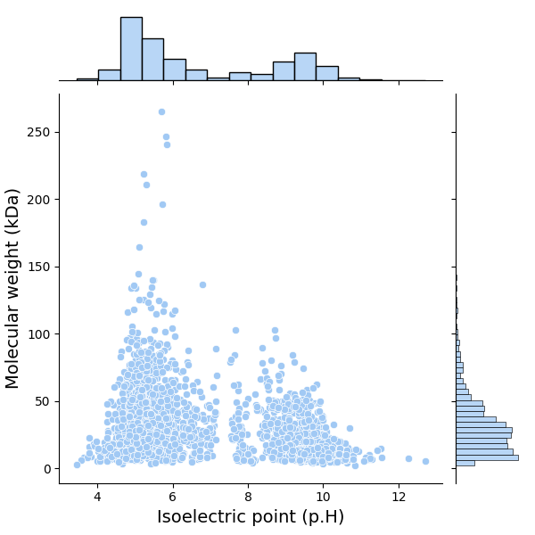
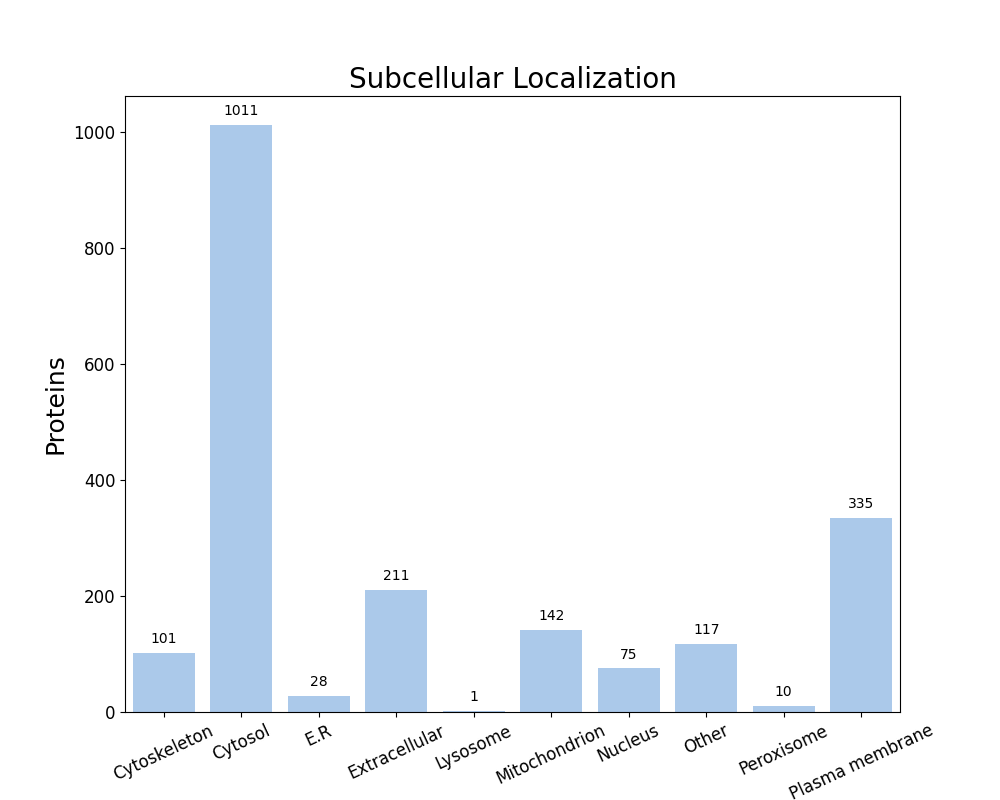

FastProtein Software 1.0
========================
##### Protein Information Software

---
### Summary
| Information                          | Value              |
| ------------------------------------ | ------------------ |
| Processed proteins                   | 2031               |
| Molecular mass (kda) mean            | 32.49 &#177; 24.79 |
| Isoelectric point mean               | 6.69 &#177; 2.00   |
| Hydrophicity mean                    | -0.13 &#177; 0.46  |
| Aromaticity mean                     | 0.10 &#177; 0.04   |
| Proteins with TM                     | 471                |
| Proteins with SP                     | 202                |
| Proteins with GPI                    | 17                 |
| Membrane proteins                    | 480                |
| Proteins with E.R Retention domains  | 326                |
| Proteins with NGlycosylation domains | 1222               |
### Molecular mass (kDa) vs Isoelectric point (pH)

---
### Subcellular localization (by WolfPSort) - Organism: animal

| Subcellular localization | Proteins |
| ------------------------ | -------- |
| Cytosol                  | 1011     |
| Plasma membrane          | 335      |
| Extracellular            | 211      |
| Mitochondrion            | 142      |
| Other                    | 117      |
| Cytoskeleton             | 101      |
| Nucleus                  | 75       |
| E.R                      | 28       |
| Peroxisome               | 10       |
| Lysosome                 | 1        |
---
### E.R Retention domain summary
| Domain | Quantity |
| ------ | -------- |
| RQEL   | 21       |
| KEEL   | 39       |
| SQEL   | 16       |
| ADEL   | 19       |
| AEEL   | 43       |
| AQEL   | 30       |
| REEL   | 35       |
| QEEL   | 34       |
| KQEL   | 22       |
| SEEL   | 25       |
Only top 10

---
### NGlyc domain summary
| Domain | Quantity |
| ------ | -------- |
| NAS    | 95       |
| NLS    | 230      |
| NLT    | 187      |
| NIT    | 99       |
| NIS    | 117      |
| NGT    | 118      |
| NVS    | 98       |
| NFS    | 95       |
| NGS    | 129      |
| NVT    | 111      |
Only top 10

---
| Id     | Length |  kDa   | Isoelectric_Point | Hydropathy | Aromaticity |  Localization   | TMHMM_2 | Phobius_TM | PredGPI | Membrane_evidences | Membrane_evidences_detail |  SignalP5   | Phobius_SP | ER_Retention_Total | NGlyc_Total |           ER_Retention_Domains            |                                                                                                                          NGlyc_Domains                                                                                                                          |                                Header                                | Local_alignment_description | Gene_Ontology | Interpro_Annotation | PFAM_Annotation | Panther_Annotation |
| ------ |:------:|:------:|:-----------------:|:----------:|:-----------:|:---------------:|:-------:|:----------:|:-------:|:------------------:|:-------------------------:|:-----------:|:----------:|:------------------:|:-----------:|:-----------------------------------------:|:---------------------------------------------------------------------------------------------------------------------------------------------------------------------------------------------------------------------------------------------------------------:|:--------------------------------------------------------------------:| --------------------------- | ------------- | ------------------- | --------------- | ------------------ |
| P0A3R0 |  312   | 35.70  |       4.94        |   -0.49    |    0.12     |     Cytosol     |    0    |     0      |    -    |         0          |                           |      -      |     -      |         0          |      0      |                                           |                                                                                                                                                                                                                                                                 |          Peptide methionine sulfoxide reductase MsrA/MsrB 1          | -                           |               |                     |                 |                    |
| P0A4Q0 |  213   | 22.93  |       9.89        |    0.98    |    0.12     | Plasma membrane |    0    |     5      |    -    |         2          |    PHOBIUS_TM&#124;SL     |      -      |     Y      |         0          |      2      |                                           |                                                                                                                    NKT[193-196];NLT[204-207]                                                                                                                    |                 Glycerol-3-phosphate acyltransferase                 | -                           |               |                     |                 |                    |
| Q59947 |  1963  | 218.57 |       5.23        |   -0.68    |    0.08     |   Peroxisome    |    0    |     2      |    -    |         1          |        PHOBIUS_TM         |      -      |     Y      |         1          |     18      |               QQEL[753-757]               |       NKT[130-133];NVT[218-221];NDS[578-581];NGT[654-657];NTT[665-668];NVS[683-686];NGT[694-697];NFT[763-766];NFT[778-781];NLS[847-850];NGT[878-881];NAS[941-944];NRS[958-961];NVT[1024-1027];NVT[1054-1057];NKS[1133-1136];NTS[1344-1347];NTS[1398-1401]       |                      Immunoglobulin A1 protease                      | -                           |               |                     |                 |                    |
| Q8CWM9 |  432   | 49.56  |       8.70        |   -0.25    |    0.09     |     Cytosol     |    0    |     0      |    -    |         0          |                           |      -      |     -      |         0          |      2      |                                           |                                                                                                                     NST[43-46];NAS[412-415]                                                                                                                     |                       Competence protein ComFA                       | -                           |               |                     |                 |                    |
| Q8CY87 |  328   | 37.11  |       4.85        |   -0.52    |    0.05     |     Cytosol     |    0    |     0      |    -    |         0          |                           |      -      |     -      |         1          |      0      |               SQEL[163-167]               |                                                                                                                                                                                                                                                                 |                       RNA-binding protein KhpB                       | -                           |               |                     |                 |                    |
| Q8CYJ8 |  551   | 60.81  |       5.07        |   -0.52    |    0.07     | Plasma membrane |    0    |     1      |    -    |         2          |    PHOBIUS_TM&#124;SL     |      -      |     -      |         1          |      6      |                AEEL[46-50]                |                                                                                          NET[125-128];NYT[262-265];NLS[399-402];NLT[411-414];NIS[467-470];NQT[510-513]                                                                                          |                  Endolytic murein transglycosylase                   | -                           |               |                     |                 |                    |
| Q8DMY4 |  392   | 41.70  |       5.84        |   -0.40    |    0.05     |  Extracellular  |    0    |     0      |    -    |         0          |                           | SP(Sec/SPI) |     Y      |         0          |      5      |                                           |                                                                                                 NLT[42-45];NQS[100-103];NLT[255-258];NAS[282-285];NRT[365-368]                                                                                                  |                     Peptidoglycan hydrolase PcsB                     | -                           |               |                     |                 |                    |
| Q8DN88 |  108   | 12.20  |       9.52        |   -0.26    |    0.06     |  Extracellular  |    0    |     0      |    -    |         0          |                           |      -      |     Y      |         0          |      1      |                                           |                                                                                                                           NLT[37-40]                                                                                                                            |                       Competence protein ComGC                       | -                           |               |                     |                 |                    |
| Q8DNB6 |  731   | 80.80  |       5.75        |   -0.42    |    0.09     |     Cytosol     |    0    |     1      |    -    |         1          |        PHOBIUS_TM         |      -      |     -      |         0          |      6      |                                           |                                                                                          NLT[321-324];NTS[352-355];NHT[433-436];NAS[538-541];NGT[573-576];NLS[690-693]                                                                                          |                    Penicillin-binding protein 2a                     | -                           |               |                     |                 |                    |
| Q8DNS0 |  659   | 72.29  |       8.45        |   -0.29    |    0.05     |     Cytosol     |    0    |     1      |    -    |         1          |        PHOBIUS_TM         |      -      |     -      |         0          |      5      |                                           |                                                                                                NSS[235-238];NES[278-281];NES[472-475];NST[518-521];NKT[640-643]                                                                                                 |                 Serine/threonine-protein kinase StkP                 | -                           |               |                     |                 |                    |
| Q8DNZ8 |  260   | 29.19  |       4.77        |   -0.47    |    0.12     |     Cytosol     |    0    |     0      |    -    |         0          |                           |      -      |     -      |         0          |      1      |                                           |                                                                                                                          NQT[136-139]                                                                                                                           | Lipid II isoglutaminyl synthase (glutamine-hydrolyzing) subunit GatD | -                           |               |                     |                 |                    |
| Q8DNZ9 |  447   | 49.58  |       6.14        |   -0.06    |    0.09     |  Mitochondrion  |    0    |     0      |    -    |         0          |                           |      -      |     -      |         0          |      1      |                                           |                                                                                                                          NRS[249-252]                                                                                                                           | Lipid II isoglutaminyl synthase (glutamine-hydrolyzing) subunit MurT | -                           |               |                     |                 |                    |
| Q8DP63 |  463   | 52.67  |       5.44        |   -0.42    |    0.09     |  Extracellular  |    0    |     1      |    -    |         1          |        PHOBIUS_TM         |      -      |     -      |         0          |      6      |                                           |                                                                                            NKS[1-4];NVT[128-131];NFS[201-204];NVS[304-307];NHS[324-327];NGS[409-412]                                                                                            |            Peptidoglycan-N-acetylglucosamine deacetylase             | -                           |               |                     |                 |                    |
| Q8DPI6 |  229   | 26.88  |       4.59        |   -0.33    |    0.14     |     Cytosol     |    0    |     0      |    -    |         0          |                           |      -      |     Y      |         1          |      0      |                KEEL[89-93]                |                                                                                                                                                                                                                                                                 |                Choline-phosphate cytidylyltransferase                | -                           |               |                     |                 |                    |
| Q8DPL8 |  449   | 51.71  |       5.20        |   -0.28    |    0.07     |       E.R       |    0    |     1      |    -    |         1          |        PHOBIUS_TM         |      -      |     -      |         0          |      6      |                                           |                                                                                           NIT[69-72];NDT[119-122];NRS[135-138];NVS[214-217];NAT[272-275];NFT[283-286]                                                                                           |           Sensor histidine protein kinase/phosphatase WalK           | -                           |               |                     |                 |                    |
| Q8DPQ3 |  237   | 27.18  |       4.78        |   -0.35    |    0.13     |     Cytosol     |    0    |     0      |    -    |         0          |                           |      -      |     -      |         1          |      1      |                KQEL[61-65]                |                                                                                                                          NHT[206-209]                                                                                                                           |                   Pyrimidine 5'-nucleotidase PynA                    | -                           |               |                     |                 |                    |
| Q8DQ15 |  163   | 18.97  |       4.88        |   -0.85    |    0.04     |     Cytosol     |    0    |     0      |    -    |         0          |                           |      -      |     -      |         0          |      0      |                                           |                                                                                                                                                                                                                                                                 |                 Regulator of chromosome segregation                  | -                           |               |                     |                 |                    |
| Q8DQ36 |  551   | 63.31  |       8.50        |   -0.53    |    0.07     |     Cytosol     |    0    |     0      |    -    |         0          |                           |      -      |     -      |         3          |      1      | ANEL[206-210];REEL[405-409];KEEL[459-463] |                                                                                                                          NLS[253-256]                                                                                                                           |                          Rqc2 homolog RqcH                           | -                           |               |                     |                 |                    |
| Q8DQG4 |   79   |  8.99  |       5.74        |   -0.04    |    0.05     |     Cytosol     |    0    |     0      |    -    |         0          |                           |      -      |     -      |         0          |      0      |                                           |                                                                                                                                                                                                                                                                 |                       RNA-binding protein KhpA                       | -                           |               |                     |                 |                    |
| Q8DR55 |  464   | 51.54  |       4.68        |   -0.76    |    0.07     |      Other      |    0    |     1      |    -    |         1          |        PHOBIUS_TM         |      -      |     -      |         0          |      7      |                                           |                                                                                   NLS[142-145];NQS[198-201];NKT[217-220];NTT[338-341];NET[349-352];NQS[379-382];NNS[387-390]                                                                                    |                     Mid-cell-anchored protein Z                      | -                           |               |                     |                 |                    |
| Q8DR59 |  719   | 79.70  |       5.41        |   -0.54    |    0.10     |  Extracellular  |    0    |     1      |    -    |         1          |        PHOBIUS_TM         |      -      |     -      |         0          |      8      |                                           |                                                                             NLS[196-199];NVS[352-355];NIT[417-420];NTT[467-470];NYT[561-564];NNS[688-691];NNT[697-700];NTT[703-706]                                                                             |                    Penicillin-binding protein 1A                     | -                           |               |                     |                 |                    |
| Q8DR60 |  1767  | 196.14 |       5.73        |   -0.66    |    0.10     |   Peroxisome    |    0    |     1      |    -    |         1          |        PHOBIUS_TM         |      -      |     Y      |         0          |     18      |                                           | NAT[176-179];NAS[256-259];NET[386-389];NNT[473-476];NAS[695-698];NGT[899-902];NGS[908-911];NRS[1124-1127];NKS[1146-1149];NAT[1165-1168];NVT[1189-1192];NNS[1213-1216];NRT[1254-1257];NWS[1282-1285];NAS[1387-1390];NYT[1440-1443];NLS[1455-1458];NLS[1514-1517] |                 Endo-alpha-N-acetylgalactosaminidase                 | -                           |               |                     |                 |                    |
| P0A307 |   66   |  7.26  |       6.01        |    1.13    |    0.14     | Plasma membrane |    0    |     1      |    -    |         2          |    PHOBIUS_TM&#124;SL     |      -      |     Y      |         0          |      1      |                                           |                                                                                                                            NLT[1-4]                                                                                                                             |                        ATP synthase subunit c                        | -                           |               |                     |                 |                    |
| P0A3C4 |  299   | 34.01  |       6.41        |   -0.29    |    0.07     |     Cytosol     |    0    |     0      |    -    |         0          |                           |      -      |     -      |         0          |      1      |                                           |                                                                                                                          NVS[156-159]                                                                                                                           |                              GTPase Era                              | -                           |               |                     |                 |                    |
| P0A3M6 |  680   | 73.87  |       5.10        |   -0.26    |    0.09     |  Extracellular  |    0    |     1      |    -    |         1          |        PHOBIUS_TM         |      -      |     -      |         0          |      7      |                                           |                                                                                   NLT[109-112];NYT[165-168];NDS[197-200];NQT[404-407];NYT[521-524];NIS[574-577];NLT[655-658]                                                                                    |                    Penicillin-binding protein 2B                     | -                           |               |                     |                 |                    |
| P0A3N0 |  328   | 35.36  |       5.09        |   -0.02    |    0.08     |     Cytosol     |    0    |     0      |    -    |         0          |                           |      -      |     -      |         1          |      1      |                AQEL[31-35]                |                                                                                                                          NKS[104-107]                                                                                                                           |                       L-lactate dehydrogenase                        | -                           |               |                     |                 |                    |
##### Only top 10 proteins

---

##### Do you have a question or tips? Please contact us! E-mail: renato.simoes@ifsc.edu.br
Generated time: Tue Apr 07 19:12:33 UTC 2026